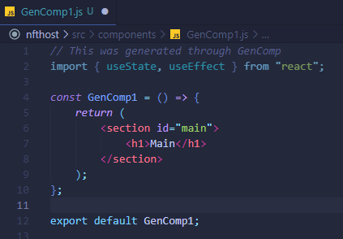

# gencomp

> SAY GOODBYE TO HUGE NESTED COMPONENTS!

GenComp is a vscode extension that generates a new component for the selected line(s) of code. Furthermore, it extracts the selected code and copies its imports and create a new react component from it.

DEMO:
https://www.youtube.com/watch?v=3QkPesu2xHs

## Install

Install through VS Code extensions. Search for `gencomp`

Can also be installed in VS Code: Launch VS Code Quick Open (Ctrl+P), paste the following command, and press enter.

```
ext install StephenAsuncion.gencomp
```

## Instruction

Once you've installed the [extension](https://marketplace.visualstudio.com/items?itemName=StephenAsuncion.gencomp), open your project folder. To be able to generate components we need an output folder.

To set an output folder, right-click on any folder and choose `GenComp: Set Output Path`.


Now that you've setup your output path, you can now select JSX code to extract.
Right-click on your selection and choose `GenComp: Generate Component`.


After this you would see a `GenComp<#>.js/tsx` component in your `outputPath`.



## License

[MIT](https://github.com/stephenasuncionDEV/gencomp/blob/main/LICENSE)
